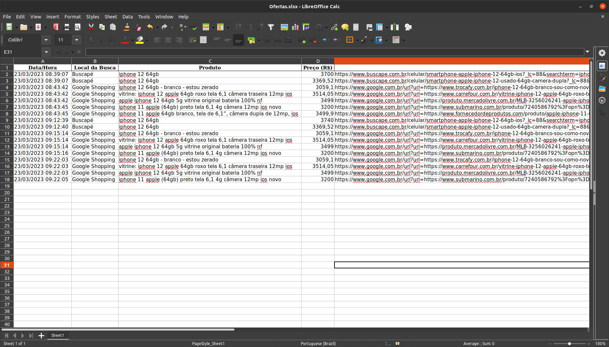

# Robô Buscador de Preços

## Contextualização

Como Analista de Compras sua principal tarefa consiste em identificar qual fornecedor oferece o melhor preço para cada um dos produtos de sua empresa.

Diariamente, você busca no Google Shopping e no Buscapé os preços dos seguintes produtos: iPhone 12 64GB e Placa de Vídeo RTX 3060.

A fim de tornar sua busca mais refinada, você usa os critérios definidos na planilha `produtos.xlsx`, a qual especifica os preços mínimo e máximo para cada produto bem como os termos de busca e os termos banidos.

Por fim, você sumariza os resultados de sua busca numa tabela que é enviada por e-mail para o seguinte endereço: diegotorrescoder@gmail.com.

## Bibliotecas Utilizadas

Neste projeto, foram usadas as seguintes bibliotecas:

- os
- datetime
- pandas
- selenium
- webdriver-manager

## Divisão do Problema

Para resolver este desafio, este foi o passo a passo adotado:

- Criar um navegador do Google Chrome
- Importar a base de dados `produtos.xlsx`
- Visualizar a base de dados
- Procurar cada produto no Google Shopping e no Buscapé
    - Verificar se o produto do anúncio possui todos os termos da busca
    - Verificar se o produto do anúncio não contém os termos banidos
    - Verificar se o preço do produto do anúncio está dentro da faixa de preços admitida
- Salvar as ofertas em um dataframe
- Exportar o dataframe como uma planilha do Excel
- Enviar por e-mail os resultados    

## Demonstrações

Veja a planilha que obtive no dia 22/03/2023:



## Como Reproduzir este Projeto

Inicialmente, navegue para a pasta na qual deseja clonar o repositório deste projeto. Em seguida, clone este repositório com o seguinte comando:

```bash
git clone https://github.com/diego-torres-coder/Robo-Buscador-de-Precos.git
```

Para criar o ambiente virtual, navegue até a pasta do projeto e digite o seguinte comando no terminal:

```bash
conda create -n scrapper-robot python=3.10
```

Em seguida, ative o ambiente:

```bash
conda activate scrapper robot
```

Com o ambiente ativo, instale as dependências do projeto:

```bash
pip3 install numpy pandas openpyxl jupyter selenium webdriver-manager
```

Alternativamente, você pode instalar as dependências deste projeto a partir do arquivo `requirements.txt`:

```bash
pip3 install -r requirements.txt
```

Execute o Jupyter Notebook:

```bash
jupyter notebook
```

Abra o arquivo principal deste projeto e execute todas as células.

